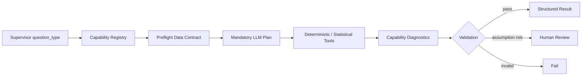

# DAAA 고급 분석 Capability 확장 설계

## 1. 왜 별도 Capability가 필요한가

고급 인과추론, 시계열 예측, MMM, 확률적 CLV, 공간분석, 최적화는 단순히 함수를
하나 추가해서 처리할 수 있는 분석이 아니다. 각각 필요한 데이터 구조, 통계적 가정,
검증 방법, 실패 조건과 업무 위험이 다르다.

따라서 기존 `tools.py`에 모든 로직을 몰아넣지 않고 다음 구조의 전문 capability로
분리한다.

```text
agents/analysis/
|-- catalog.py
|-- workflow.py
|-- schemas.py
`-- capabilities/
    |-- causal/
    |   |-- contract.py
    |   |-- planner.py
    |   |-- tools.py
    |   |-- diagnostics.py
    |   `-- insight.py
    |-- forecasting/
    |-- mmm/
    |-- clv/
    |-- geospatial/
    `-- optimization/
```

각 capability는 공통적으로 다음 인터페이스를 제공한다.

```python
class AnalysisCapability(Protocol):
    name: str
    question_types: set[str]
    plan_schema: type[BaseModel]
    result_schema: type[BaseModel]

    def preflight(self, context: AnalysisContext) -> list[LocalCheck]: ...
    def tools(self) -> list[BaseTool]: ...
    def validate_result(self, result: BaseModel) -> list[LocalCheck]: ...
```

---

## 2. 공통 실행 흐름



공통 원칙:

- LLM planner는 항상 실행한다.
- LLM은 방법과 변수 역할을 선택하지만 수치를 직접 계산하지 않는다.
- deterministic fallback으로 다른 분석을 몰래 실행하지 않는다.
- 데이터 계약을 만족하지 않으면 분석을 시작하지 않는다.
- baseline 모델은 fallback이 아니라 성능 비교 기준이다.
- 결과에는 추정값뿐 아니라 불확실성, 진단, 가정과 실패 사유를 포함한다.
- 인과 결론, 예산 배분, 운영 의사결정은 HITL 없이 자동 적용하지 않는다.

---

## 3. 고급 인과추론 Capability

### 지원 질문

- 정책 또는 캠페인이 KPI를 실제로 변화시켰는가?
- 가격 변경의 평균 처치 효과는 얼마인가?
- 특정 기능 출시 전후의 변화가 자연 추세와 다른가?
- A/B 실험 결과가 통계적·업무적으로 유의한가?

### 입력 계약

| 역할 | 필수 여부 | 설명 |
| --- | --- | --- |
| `outcome` | 필수 | 분석 대상 KPI |
| `treatment` | 필수 | 처치·노출 여부 또는 강도 |
| `unit_id` | 필수 | 고객, 매장, 지역 등의 분석 단위 |
| `time` | 설계별 필수 | DiD, interrupted time series 등 |
| `confounders` | 관찰 연구 필수 | 처치와 결과에 동시에 영향을 주는 변수 |
| `instrument` | IV 분석 시 필수 | 처치에는 영향을 주지만 결과에는 직접 영향이 없는 변수 |

### 방법 선택

| 데이터 설계 | 분석 방법 |
| --- | --- |
| 무작위 실험 | 평균·비율 차이, CUPED, heterogeneous treatment effect |
| 관찰 단면 데이터 | propensity score weighting/matching, doubly robust AIPW |
| 처치 전후 패널 데이터 | Difference-in-Differences |
| 개입이 있는 단일 시계열 | interrupted time series |
| 비교 대상이 적은 집계 시계열 | synthetic control |
| 유효한 도구변수 존재 | instrumental variables |

### 구조화 출력

- `estimand`: ATE, ATT, CATE 등
- 효과 추정값, 표준오차, 신뢰구간, p-value
- propensity overlap과 positivity 진단
- 처치 전후 공변량 balance와 standardized mean difference
- DiD parallel-trend 진단
- sensitivity analysis
- 식별 가정과 위반 가능성

### 실패 및 HITL

- treatment 또는 outcome 정의가 모호하면 실패
- 관찰 연구에서 confounder가 없으면 인과 결과 생성 금지
- overlap이 부족하면 실패 또는 대상 범위 제한
- parallel trend가 지지되지 않으면 DiD 결론 금지
- 최종 인과 해석은 사람의 검토 필수

### 의존성 후보

- `statsmodels`: 회귀, DiD, IV, 진단
- `scikit-learn`: propensity model, nuisance model
- 선택적으로 `DoWhy`/`EconML`: identification, doubly robust/CATE 확장

---

## 4. ARIMA 계열 시계열 예측 Capability

### 지원 질문

- 다음 3개월 매출과 예측 구간은 얼마인가?
- 주간 수요의 추세와 계절성을 반영한 예측은?
- 외부 변수까지 반영했을 때 재고 수요가 어떻게 변하는가?

### 입력 계약

- 단조 증가하는 `time_column`
- 수치형 `target`
- 명시적인 frequency
- forecast horizon
- 선택적 exogenous variables
- 다중 시계열이면 series ID

### 방법 선택

| 데이터 특성 | 분석 방법 |
| --- | --- |
| 비계절·정상 시계열 | ARIMA |
| 계절성이 있는 시계열 | SARIMA |
| 외생 변수가 있는 시계열 | SARIMAX |
| 수준·추세·계절성 중심 | ETS / exponential smoothing |
| 간헐적 수요 | Croston 계열 별도 도구 |

항상 다음 baseline과 비교한다.

- naive forecast
- seasonal naive forecast
- moving average baseline

### 검증

- 단일 random split 금지
- rolling-origin 또는 expanding-window backtest
- MAE, RMSE, sMAPE, MASE
- Ljung-Box residual autocorrelation
- 잔차 평균과 분산 안정성
- 예측 구간 coverage
- 학습 기간과 forecast horizon 표시

### 구조화 출력

- 선택 모델과 order `(p,d,q)`, seasonal order
- 모델 선택 근거와 baseline 비교
- backtest fold별 지표
- forecast point와 lower/upper interval
- residual diagnostics
- exogenous variable 시나리오

### 의존성 후보

- `statsmodels`의 ARIMA, SARIMAX, ExponentialSmoothing

---

## 5. Marketing Mix Modeling Capability

### 지원 질문

- 각 마케팅 채널이 매출에 얼마나 기여했는가?
- 채널별 ROAS와 marginal ROAS는?
- 예산을 어느 채널로 옮겨야 하는가?

### 입력 계약

| 역할 | 설명 |
| --- | --- |
| `date` | 주 단위 또는 일 단위 시점 |
| `outcome` | 매출, 전환 등 KPI |
| `channel_spend` | 채널별 비용 또는 노출 |
| `controls` | 가격, 프로모션, 휴일, 거시 변수 등 |
| `geo` | 지역 단위 MMM이면 필수 |

권장 조건:

- 주 단위 기준으로 충분한 장기 이력
- 채널별 spend variation
- 대형 프로모션과 외부 요인 기록
- 채널 간 완전한 공선성이 없어야 함

### 모델

- adstock/carryover transformation
- saturation curve
- trend와 seasonality
- Bayesian prior를 사용한 채널 계수 안정화
- posterior predictive distribution

### 검증

- R-hat, effective sample size, divergence
- posterior predictive check
- holdout predictive accuracy
- residual autocorrelation
- 채널 기여도와 실제 매출 reconciliation
- prior/posterior sensitivity

### 구조화 출력

- 채널별 contribution과 uncertainty interval
- ROAS, marginal ROAS
- adstock decay와 saturation parameter
- baseline sales
- budget response curve
- 최적화에 넘길 channel constraint

### HITL

예산 재배분은 분석 결과만으로 자동 실행하지 않는다. 채널별 최소·최대 집행액,
브랜드 정책, 계약 조건을 사람이 확인한 후 Optimization Capability로 전달한다.

### 의존성 후보

- `PyMC`
- `PyMC-Marketing` MMM
- `ArviZ` 진단

---

## 6. 확률적 CLV Capability

### 지원 질문

- 고객의 향후 구매 횟수와 기대 매출은?
- 현재 살아 있을 확률이 높은 고객은?
- 고객별 6개월·12개월 CLV는?

### 입력 계약

- customer ID
- transaction timestamp
- transaction amount
- calibration end date
- holdout end date
- discount rate와 forecast horizon

### 방법 선택

| 고객 관계 | 방법 |
| --- | --- |
| 비계약형 반복 구매 | BG/NBD 또는 Pareto/NBD |
| 구매금액 예측 | Gamma-Gamma |
| 계약형 서비스 | churn/survival model + expected margin |

### 검증

- calibration/holdout 분리
- predicted vs actual repeat purchases
- frequency/recency calibration plot
- 구매 빈도와 금액 독립성 진단
- cohort별 calibration
- CLV uncertainty interval

### 구조화 출력

- probability alive
- expected purchases by horizon
- expected average order value
- discounted CLV
- uncertainty interval
- calibration/holdout metrics
- 가치 segment

### 주의

현재 구현된 RFM은 과거 행동 점수이며 확률적 CLV가 아니다. 두 결과를 같은 의미로
사용하지 않는다.

### 의존성 후보

- `PyMC-Marketing` CLV 또는 검증된 BG/NBD 구현
- Bayesian 구현 시 `PyMC`, `ArviZ`

---

## 7. 공간분석 Capability

### 지원 질문

- 어느 지역에 수요 또는 이탈이 집중되는가?
- 매장 반경 내 고객과 매출은?
- 신규 매장 후보지의 접근성과 잠재 수요는?

### 입력 계약

- latitude/longitude 또는 geometry
- 명시적인 CRS
- entity/region ID
- 분석 metric
- 선택적 boundary polygon, road/travel-time data

### 분석 방법

- point-in-polygon spatial join
- 거리와 반경 분석
- 지역별 집계와 choropleth용 결과
- Moran's I 공간 자기상관
- Local Moran / Getis-Ord hotspot
- nearest facility와 coverage
- territory overlap

### 검증

- CRS 누락 또는 불일치 시 실패
- invalid geometry 검사 및 수정 기록
- latitude/longitude 범위 검사
- 거리 분석에는 projected CRS 사용
- 작은 지역·소수 고객 개인정보 노출 방지
- 공간 자기상관 검정의 다중검정 보정

### 구조화 출력

- 사용 CRS
- geometry validation 결과
- spatial join match rate
- hotspot 통계와 보정 p-value
- 거리·coverage 지표
- GeoJSON 또는 공간 아티팩트 참조

### 의존성 후보

- `GeoPandas`, `Shapely`, `pyproj`
- `libpysal`, `esda` 공간통계

---

## 8. 최적화 Capability

### 지원 질문

- 제한된 예산을 어디에 배분해야 하는가?
- 재고와 서비스 수준을 만족하는 발주량은?
- 인력·차량·생산 일정을 어떻게 배치해야 하는가?

### 입력 계약

- decision variables
- objective: maximize/minimize
- 선형 또는 비선형 objective coefficient
- equality/inequality constraints
- variable bounds
- integer/binary 여부
- 업무상 hard constraint와 soft constraint 구분

### Solver 선택

| 문제 유형 | Solver |
| --- | --- |
| 연속 선형계획 | SciPy `linprog` |
| 혼합정수 선형계획 | SciPy `milp` 또는 OR-Tools |
| 스케줄링·배차·조합 | OR-Tools CP-SAT / routing |
| MMM 예산 배분 | response curve 기반 constrained optimization |

### 검증

- feasibility 검사
- constraint violation이 0인지 확인
- slack과 binding constraint 반환
- baseline 대비 objective 개선량
- 작은 문제의 경우 대안 시나리오 비교
- infeasible/unbounded 상태를 성공으로 처리하지 않음

### 구조화 출력

- solver status
- objective value
- decision variable allocation
- constraint slack과 binding 여부
- baseline 대비 개선량
- 가정과 민감도 시나리오

### HITL

최적화 결과는 권고안이다. 실제 예산, 가격, 인력, 재고 변경은 반드시 사람의 승인을
거쳐야 한다.

### 의존성 후보

- 현재 설치된 SciPy의 `linprog`/`milp`
- 복잡한 정수·배차 문제에는 `OR-Tools`

---

## 9. 공통 구조화 출력

고급 capability는 공통 envelope 안에 capability별 결과를 넣는다.

```python
class AdvancedAnalysisResult(BaseModel):
    capability: Literal[
        "causal",
        "forecasting",
        "mmm",
        "clv",
        "geospatial",
        "optimization",
    ]
    method: str
    estimates: dict
    uncertainty: dict
    diagnostics: list[DiagnosticResult]
    assumptions: list[AssumptionResult]
    evidence: list[ArtifactEvidence]
    limitations: list[str]
    human_review: HumanReview
```

capability별 상세 결과는 Pydantic discriminated union으로 정의한다. 예를 들어 forecast
결과에만 `forecast_horizon`, MMM 결과에만 `channel_contributions`가 존재하도록 한다.

---

## 10. 구현 순서

### Phase 1: 공통 프레임

- `capabilities/` plugin protocol
- capability registry
- capability별 plan/result discriminated union
- preflight data contract node
- diagnostics node
- dependency missing error 표준화

### Phase 2: Forecasting + Causal

- statsmodels 의존성 추가
- naive/seasonal naive baseline
- SARIMAX/ETS와 rolling-origin validation
- RCT, regression adjustment, DiD
- overlap/balance/parallel-trend 진단

두 영역은 대부분의 기업 KPI 분석에 공통으로 사용되므로 먼저 구현한다.

### Phase 3: CLV + MMM

- PyMC 계열 의존성 추가
- BG/NBD + Gamma-Gamma 또는 Bayesian CLV
- Bayesian MMM, adstock, saturation, posterior diagnostics
- 모델 실행 시간이 길기 때문에 별도 worker와 timeout 정책 필요

### Phase 4: Geospatial + Optimization

- GeoPandas/공간통계 의존성 추가
- 공간 아티팩트 계약과 개인정보 보호 규칙
- SciPy optimization 기본 도구
- OR-Tools 기반 정수·배차 확장
- 실행 전후 승인 정책

---

## 11. 완료 기준

각 capability는 다음 조건을 모두 만족해야 지원 완료로 표시한다.

- 입력 데이터 계약 테스트
- 최소 1개 baseline과 전문 모델 비교
- time-aware 또는 design-aware validation
- 불확실성 또는 prediction interval
- 가정 진단과 실패 조건
- structured output schema
- artifact lineage
- HITL 조건
- 합성 데이터 recovery test
- edge case와 실패 테스트
- 팀 문서와 사용 예시

패키지가 설치되고 함수가 한 번 실행된 것만으로는 완료로 보지 않는다.

---

## 12. 현재 설치된 분석 런타임

| 패키지 | 설치 버전 | 사용 목적 |
| --- | --- | --- |
| `statsmodels` | 0.14.6 | 가설검정, 회귀, ARIMA/SARIMAX, 통계 진단 |
| `pymc-marketing` | 0.19.3 | Bayesian MMM, 확률적 CLV |
| `geopandas` | 1.1.3 | 공간 데이터와 spatial join |
| `libpysal` | 4.14.1 | 공간 가중치와 공간분석 기반 기능 |
| `esda` | 2.10.0 | Moran's I와 hotspot 통계 |
| `ortools` | 9.15.6755 | 정수계획, 스케줄링, 배차 최적화 |
| `dowhy` | 0.14 | 인과 식별, 추정, refutation |
| `scipy` | 1.15.3 | 수치 계산과 보조 진단 |

`pip check` 결과 의존성 충돌은 없다.

현재 Windows 실행 환경에는 `g++`가 없어 PyTensor가 C 구현 대신 Python 구현을
사용한다. PyMC-Marketing 모델은 실행 가능하지만 Bayesian 샘플링이 느려질 수 있으므로,
운영 worker에서는 C++ toolchain을 포함한 별도 이미지 또는 sampler 실행 환경을 두는
것이 적절하다.

### Analysis Agent 연결 상태

| Capability | LangChain 도구 | 검증 상태 |
| --- | --- | --- |
| Bayesian MMM | `run_bayesian_mmm` | 52주 synthetic 데이터로 실제 MCMC와 채널 contribution 추출 확인 |
| 확률적 CLV | `estimate_probabilistic_clv` | 20명 반복구매 synthetic 데이터로 BG/NBD·Gamma-Gamma MCMC와 CLV 추출 확인 |
| 공간분석 | `analyze_geospatial_hotspots` | GeoPandas·KNN·Global/Local Moran 실제 실행 테스트 |
| 최적화 | `optimize_business_allocation` | OR-Tools budget allocation 실제 solver 실행 테스트 |

네 도구는 `catalog.py`, LLM planner 허용 목록, `tool_parameters` 컬럼 검증,
`insight.py`, `self_check.py`와 `ANALYSIS_TOOLS` registry에 연결되어 있다.
