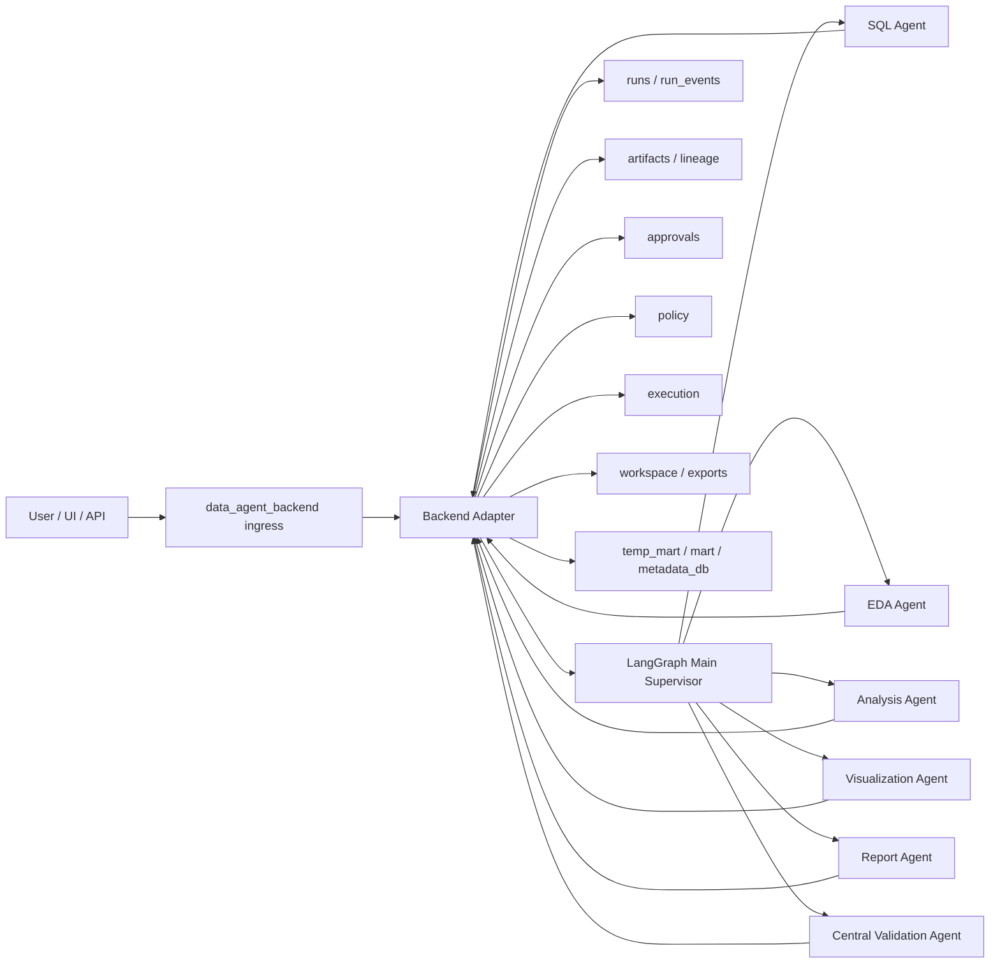
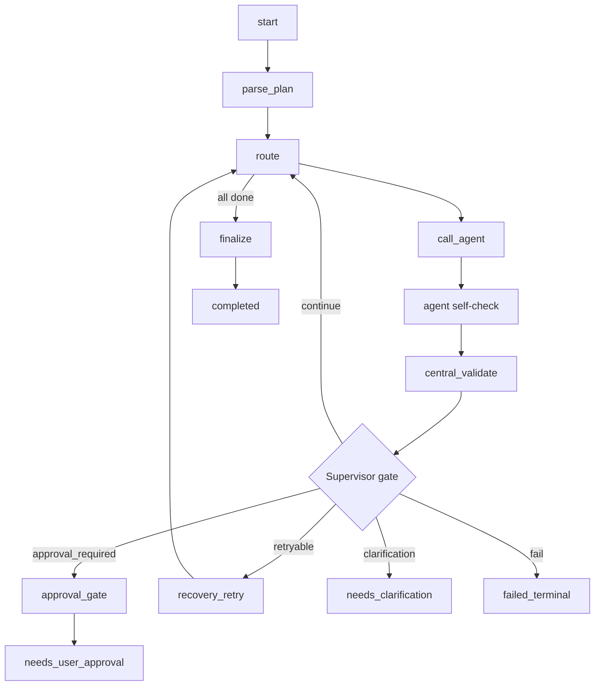

# BOAZ_adv SQL Agent Architecture

## Current Implementation Status

The active orchestration package is `DATA_Analyst_Assistant_Agent/`.

`data_agent_backend/` is treated as a fixed backend platform dependency. The orchestration layer must consume it through `BackendAdapter` and must not modify backend internals.

The legacy implementation folders `sql_agent/`, `eda_agent/`, and `Data_Analysis_Agent/` are not part of the active orchestration branch.

## Target Request Flow

```text
User / UI / API
-> data_agent_backend API run/session bootstrap
-> Backend Adapter
-> LangGraph Main Supervisor
-> SQL / Validation / EDA / Analysis / Visualization / Report Agents
-> Backend Adapter
-> data_agent_backend runs / artifacts / approvals / policy / execution / workspace
-> temp_mart / mart / metadata_db
-> Final Report / UI
```

`data_agent_backend` owns run records, artifact storage, approval records, policy decisions, execution helpers, workspace files, and exports. It does not own workflow routing. LangGraph Main Supervisor owns routing, retry, agent dispatch, validation gates, approval pauses, and finalization.

## Component Context



## Supervisor Graph



## Persistence Boundaries

LangGraph state is metadata-only:

```text
run_id, thread_id, user_query, goal, plan, current_step,
artifact_ids, mart_candidate_ids, mart_id, validation_status,
approval_ids, error_state
```

Backend artifacts store large or reusable outputs:

```text
SQL text, preview/result, execution log, validation output,
EDA summary, analysis summary, chart config/image, final report
```

External persistence boundaries:

```text
temp_mart
- run/session scoped temporary analysis tables

mart
- approval-gated reusable datamarts

metadata_db
- mart_id, owner, run_id, source_sql_artifact_id, schema_json,
  refresh_policy, lineage, approval_id, created_at
```

These boundaries do not require `data_agent_backend` schema changes. Backend artifacts keep references, previews, and lineage.

## Backend Adapter Boundary

The adapter is owned by the new orchestration layer. It consumes existing backend services without changing backend code.

Minimum adapter surface:

```text
create_run()
update_run_status()
append_run_event()
register_artifact()
get_artifact()
run_sql_preview()
check_policy()
request_approval()
get_approval_status()
save_workspace_file()
export_report()
```

Backend capability mapping:

| Backend capability | Orchestration need | Adapter behavior |
| --- | --- | --- |
| runs | lifecycle and node events | create/update run and append supervisor/agent events |
| artifacts | SQL, preview, summaries, chart, report, validation | register typed artifacts and return `ArtifactRef` |
| approvals | mart persistence and risky actions | create approval requests and expose status |
| policy | read-only source and write boundary checks | evaluate/enforce policy before risky actions |
| execution | SQL preview and sandboxed Python | call execution services through stable wrapper methods |
| workspace/exports | visible reports and export outputs | save reports and create exports when approved |

## Agent Contract

Every specialist agent returns a common result envelope:

```json
{
  "status": "success",
  "agent_name": "sql_agent",
  "summary": "SQL preview completed.",
  "artifact_refs": [],
  "validation": {
    "local_checks": [],
    "integrity_refs": [],
    "business_flags": []
  },
  "retry_hint": {
    "retryable": false,
    "suggested_action": "continue",
    "reason_code": "none"
  },
  "approval": {
    "required": false,
    "reason": "",
    "approval_type": ""
  },
  "next_handoff": "validation_agent"
}
```

Agent responsibilities:

| Agent | Responsibility | Self-check |
| --- | --- | --- |
| SQL | schema selection, SQL generation, read-only preview, mart candidate proposal | SQL safety, source/mart boundary, result shape |
| EDA | profile and data quality summary | profiling completeness and integrity reference coverage |
| Analysis | metric interpretation and statistical/business reasoning | prerequisites, key findings, limitations |
| Visualization | chart recommendation and renderable spec | chart spec completeness, axis/unit/label, data reference |
| Report | validated artifact narrative report | narrative completeness and validated evidence use |
| Central Validation | business-context validation | verdict, findings, retry/approval recommendation |

## Validation Strategy

Validation is layered:

```text
GE Validation
-> table/data integrity

Agent Self-Check
-> technical validity of the local output

Central Validation Agent
-> business-context and cross-step consistency

Supervisor Gate
-> continue / retry / approval / clarification / fail decision
```

GE artifacts are stored per table/result set:

```text
artifact type: file or data_profile
metadata.kind: ge_table_validation_json
filename: ge_<table_name>_<run_id>.json
```

Shared context includes only artifact refs and compact summaries, never full GE payloads.

## Mart Persistence Flow

```text
SQL-Agent creates mart_candidate
-> SQL-Agent self-check validates source boundary and result shape
-> GE validates table/data integrity
-> Central Validation-Agent checks grain, reuse value, business purpose
-> Supervisor creates approval_request
-> run enters needs_user_approval
-> user approves or rejects
```

Approved:

```text
materialize to mart
-> metadata_db registration
-> backend artifact lineage/reference registration
-> workflow continues
```

Rejected:

```text
keep temp_mart or artifact only
-> no permanent mart write
-> workflow continues or finalizes
```

## MVP Runtime Behavior

The current MVP is deterministic and artifact-based. It is meant to prove the architecture contract, not to be a final smart analyst.

Current paths:

```text
simple query
-> SQL Agent
-> Central Validation Agent
-> Report Agent

EDA/profile query
-> SQL Agent
-> EDA Agent
-> Central Validation Agent
-> Report Agent

trend/chart query
-> SQL Agent
-> Analysis Agent
-> Visualization Agent
-> Central Validation Agent
-> Report Agent

mart persistence query
-> SQL Agent
-> Central Validation Agent
-> approval gate
-> mart metadata registration after approval
```

True parallel fan-out/fan-in is a future graph evolution. The current implementation keeps routing deterministic so the contracts, artifacts, and tests are stable.
